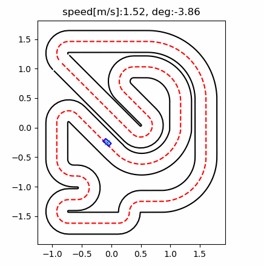

# race-opt
## Overview
A research framework for autonomous racing focused on optimal control and reinforcement learning.
Built upon and significantly extending ideas from alexliniger/gym-racecar, with modern Gymnasium support, reproducible benchmarking, and real-time telemetry.



## Quick start

### Run Samples
```
python examples/run_baseline.py --render matplotlib
python examples/run_mpc.py --render matplotlib
python tools/tune_pure_pursuit_optuna.py
```
## Dependencies
This repository currently includes:
- Environment (envs/) and Pure Pursuit baseline agent (agents/pure_pursuit/)
- Optional MPC solvers (OSQP / CasADi) may be added later
- acados-based MPC/MPCC is not included yet

### Minimal requirements
- Python 3.10+ (recommended)
- NumPy
- Gymnasium
- Matplotlib (only needed for --render matplotlib)

### Optional
- Optuna (for a parameter tuning)
- OSQP + SciPy (for QP-based MPC if/when enabled)
- CasADi (for nonlinear MPC if/when enabled)

## Implemented agents

| # | Algorithm | Lap time |
| -|-|-|
| 1 | Pure pursuite | 11.80 s |
| 2 | Minimal MPC(LQR) | 14.15 s |

## Lineage and Acknowledgements
race-opt is heavily inspired by the pioneering work of Alexander Liniger to the gym-racecar project.

In particular, this repository builds upon:
- The formulation of autonomous racing as an optimal control problem
- The use of spline-based centerline representations

While race-opt is a ground-up re-architecture and not a direct fork, the conceptual foundations established in gym-racecar are essential to this work.
